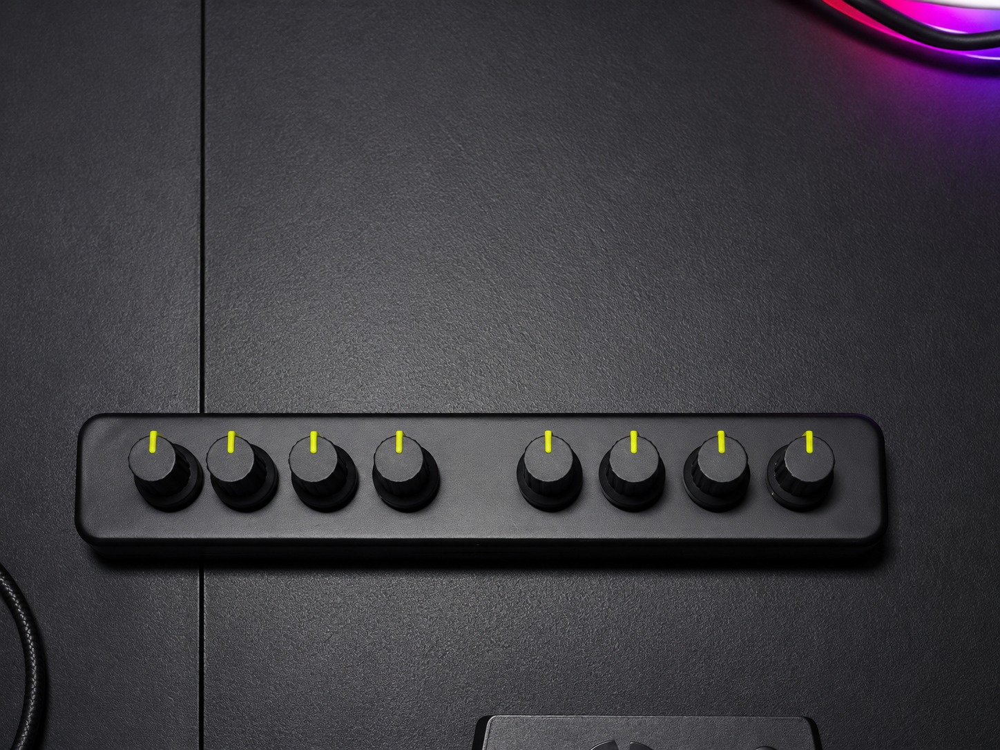
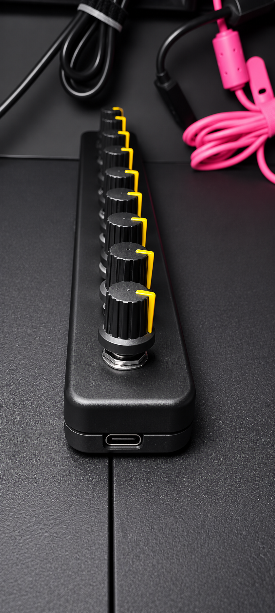

# 🎛️ 8 Encoders MIDI para Ableton Live

Controla **Ableton Live** de forma más rápida utilizando un controlador
USB HID basado en **Arduino** con **8 encoders rotativos**. Cada encoder
envía atajos de teclado configurables para agilizar la navegación y la
edición dentro del DAW.

------------------------------------------------------------------------

## 📸 galeria

### Front View

### Angled View

------------------------------------------------------------------------

## ✨ Características

-   🎛️ 8 encoders rotativos independientes.
-   ⌨️ Emulación de teclado mediante USB HID.
-   ⚡ Respuesta de baja latencia.
-   🎵 Diseñado para optimizar el flujo de trabajo en Ableton Live.
-   🔧 Atajos de teclado totalmente personalizables.

------------------------------------------------------------------------

## 🎮 Mapeo predeterminado de los encoders

Encoder  Acción
  --------- ------------------------------------
      1     Flecha Izquierda / Derecha
      2     Flecha Arriba / Abajo
      3     Shift + Flecha Izquierda / Derecha
      4     Shift + Flecha Arriba / Abajo
      5     Alt + Flecha Izquierda / Derecha
      6     Alt + Flecha Arriba / Abajo
      7     Ctrl + E / Ctrl + J
      8     Ctrl + 1 / Ctrl + 2

------------------------------------------------------------------------

## 🛠️ Hardware

-   Arduino Pro Micro, Leonardo o Micro
-   8 Encoders rotativos
-   Cable USB

------------------------------------------------------------------------

## 📚 Librerías necesarias

-   Encoder
-   HID-Project

Instálalas desde el **Administrador de Librerías** del IDE de Arduino.

------------------------------------------------------------------------

## 🔌 Conexión de los encoders

Encoder   Pines
  --------- --------
      1       2, 3
      2       4, 5
      3       6, 7
      4       8, 9
      5      10, 14
      6      15, 16
      7      A0, A1
      8      A2, A3

------------------------------------------------------------------------

## 🚀 Cómo usar

1.  Conecta todos los encoders.
2.  Instala las librerías necesarias.
3.  Selecciona una placa compatible con USB HID.
4.  Sube el sketch al Arduino.
5.  Abre Ableton Live y comienza a utilizar el controlador.

------------------------------------------------------------------------

## ℹ️ Notas

Este proyecto utiliza **emulación de teclado USB HID**, por lo que
requiere una placa con soporte USB nativo, por ejemplo:

-   Arduino Pro Micro
-   Arduino Leonardo
-   Arduino Micro

------------------------------------------------------------------------

## 📄 Licencia

MIT License

Copyright (c) 2025 David Sanchez